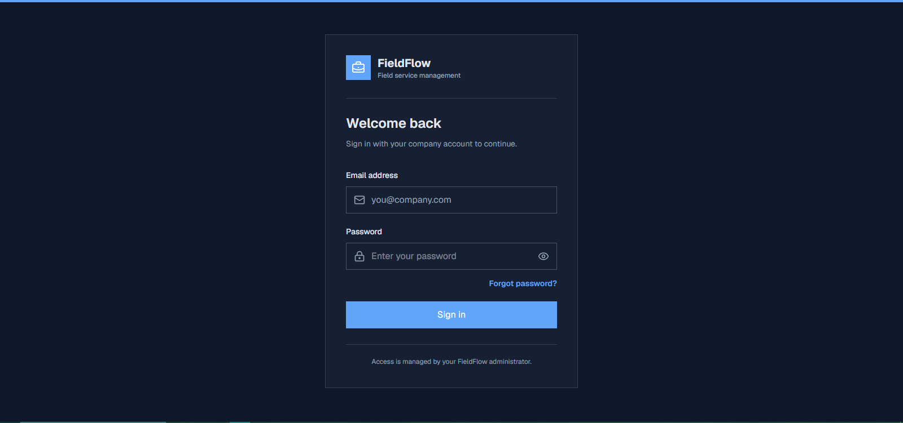
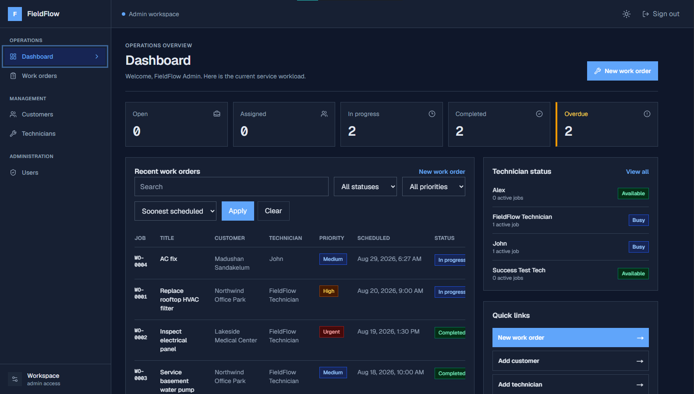
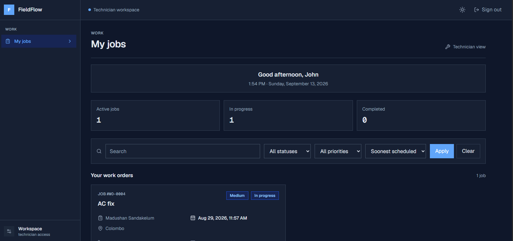
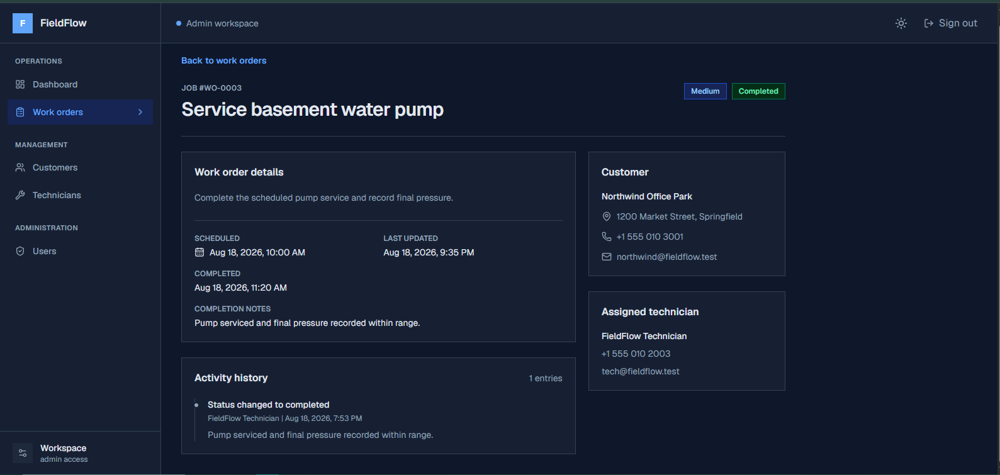

# FieldFlow

FieldFlow is a field service management system for dispatching work orders,
tracking technician progress, and managing customer and operational records.

## Current status

This repo represents the completed core system for the project scope defined in
this workspace. The application includes the main operational flow for admins,
dispatchers, and technicians.

### Implemented features

- Better Auth email/password authentication with protected routes
- role-based authorization for Admin, Dispatcher, and Technician users
- admin user management and account creation
- customer CRUD with search and validation
- technician management with status handling and offline conflict checks
- work order creation, assignment, start, complete, and cancellation flows
- dashboard metrics and recent job views
- mobile-responsive card layouts for directory and dashboard pages
- server-side Zod validation for all trusted form actions

### Planned future work

- Resend email delivery for invite/reset flows
- invite-link onboarding flow with first-time password setup
- disable/terminate user account lifecycle
- admin audit trail for account and role changes
- expanded Playwright coverage for more operational scenarios

## Tech stack

- Next.js App Router with React and TypeScript
- Tailwind CSS
- Better Auth
- Prisma ORM with PostgreSQL on Neon
- Zod validation
- Playwright for browser-level verification

## Local setup

1. Install dependencies with `npm install`.
2. Copy `.env.example` to `.env` and fill in your local values.
3. Generate the Prisma client with `npm run db:generate`.
4. Run the initial database migration with `npm run db:migrate`.
5. Seed demo users and data with `npm run db:seed`.
6. Start the app with `npm run dev`.

The app runs at `http://localhost:3000`.

## Production deployment checklist

The project is set up for Vercel deployment with a Neon PostgreSQL database.
Use the following checklist before or after deployment:

1. Set the production environment variables in Vercel:
   - `DATABASE_URL`
   - `BETTER_AUTH_SECRET`
   - `BETTER_AUTH_URL` (production app URL)
   - `ADMIN_DEMO_PASSWORD`
   - `DISPATCHER_DEMO_PASSWORD`
   - `TECHNICIAN_DEMO_PASSWORD`
2. Ensure the Neon database is reachable from Vercel and uses the same Prisma schema.
3. Run Prisma migration in production:
   ```bash
   npx prisma migrate deploy
   ```
4. Seed the demo accounts if you want the default login flows available in production:
   ```bash
   npx prisma db seed
   ```
5. Confirm the app URL is configured correctly for Better Auth callbacks.
6. Verify the following flows in the deployed app:
   - admin login
   - dispatcher login
   - technician login
   - customer creation
   - technician assignment
   - work order start and completion
   - role-based route protection

## Available commands

- `npm run dev` - start the development server
- `npm run build` - build the production app
- `npm run lint` - run ESLint
- `npm run typecheck` - TypeScript strict check
- `npm run test:e2e` - run Playwright tests
- `npm run db:generate` - generate the Prisma client
- `npm run db:migrate` - create and apply migrations
- `npm run db:seed` - seed demo data

## Repository structure

- `app/` - pages, layouts, and protected routes
- `components/` - shared UI and layout components
- `features/` - feature-specific pages and server actions
- `lib/` - auth, validation, Prisma, and utilities
- `prisma/` - schema, migrations, and seed data
- `tests/e2e/` - Playwright end-to-end tests

## Demo accounts

The seeded demo users are:

```text
Admin: admin@fieldflow.test / ADMIN_DEMO_PASSWORD
Dispatcher: dispatch@fieldflow.test / DISPATCHER_DEMO_PASSWORD
Technician: tech@fieldflow.test / TECHNICIAN_DEMO_PASSWORD
```

## App screenshots

The project screenshots are stored in [docs/images](docs/images) and match the actual app views below.

```md




```

### Example layout

<div align="center">
  
  
</div>

<div align="center">
  
  
</div>

## Notes

- Do not commit real secrets or production credentials.
- Use `.env` only locally and set environment variables in deployment settings.
- Future email and onboarding improvements should be tracked in the GitHub backlog instead of treated as current feature parity.
